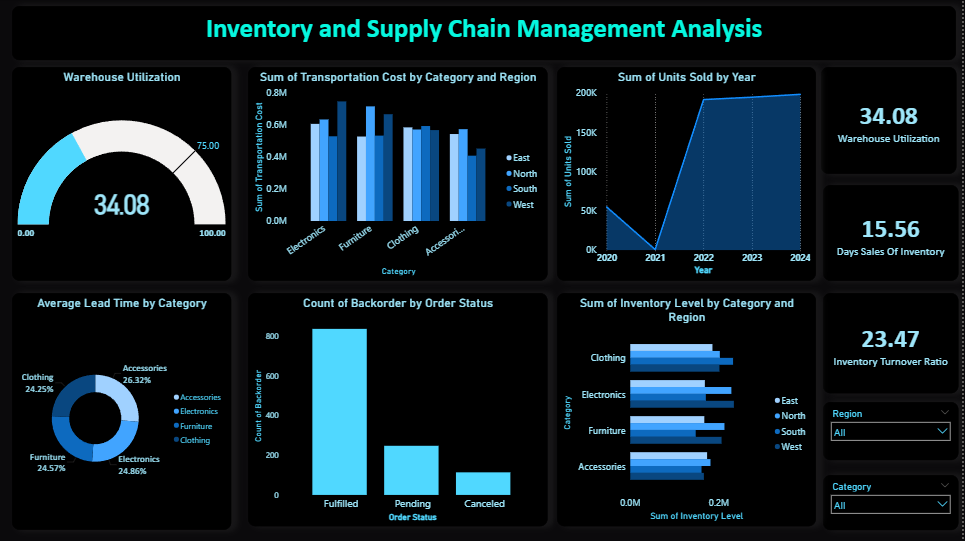

# Inventory & Supply Chain Management Analysis (Power BI)

## Objective
To analyze inventory levels, warehouse utilization, demand trends, and supply chain
performance to identify stockouts, excess inventory, and operational inefficiencies.

## KPIs
- Warehouse Utilization
- Days Sales of Inventory (DSI)
- Inventory Turnover Ratio
- Average Lead Time
- Backorder Count

## Tools Used
- Power BI Desktop
- DAX
- Microsoft Excel

## Dashboard Preview

